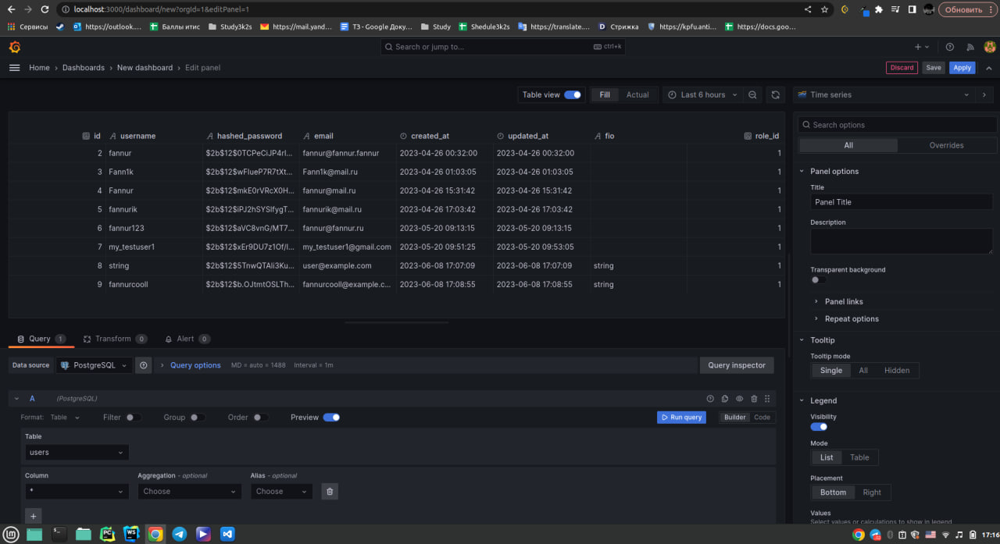
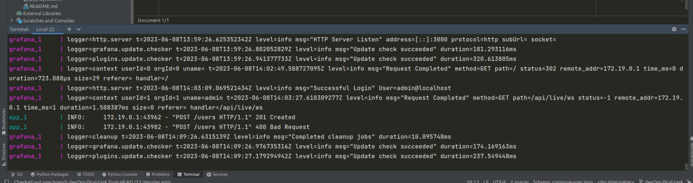
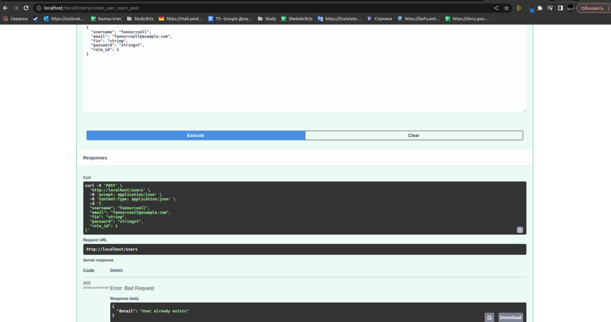

# Fiki Backend
***
- Language: 
- Framework: 
- Database: 
  

___
## How to run app
>To run the app you should follow this steps:
 
1. Install [**Docker**](https://docs.docker.com/get-docker/)
2. Go to the project directory
3. Add .env file with params:
    
   > DB_USER=postgres

    > DB_USER_PASSWORD=postgres
    
    > DB_HOST=db
    
    > DB_PORT=5432
    
    > DB_NAME=fiki
    
    > DB_URL=postgresql+asyncpg://${DB_USER}:${DB_USER_PASSWORD}@${DB_HOST}:${DB_PORT}/${DB_NAME}
    
    > AUTHJWT_SECRET_KEY=secret
    
    > AUTHJWT_DENYLIST_ENABLED=True
    
    > AUTHJWT_ACCESS_TOKEN_EXPIRES=1800
    
    > AUTHJWT_REFRESH_TOKEN_EXPIRES=1296000
    
    > REDIS_HOST=redis
    
    > REDIS_PASSWORD=secret`
3. Type in terminal `sudo docker-compose -f docker-compose.yml up --build`

**Great! That's works!**
>Check [swagger of our app](http://localhost/docs)

>Check [grafana](http://localhost:3000/?orgId=1)

___
**Screenshots**

1. Checking db Grafana

2. Grafana Logs

3. Working App

